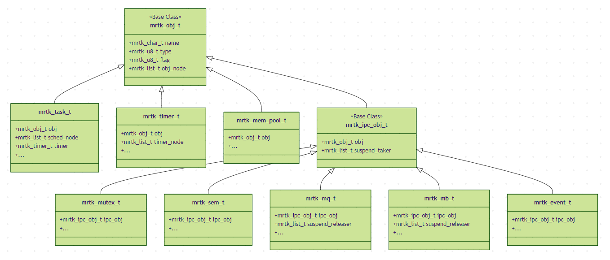
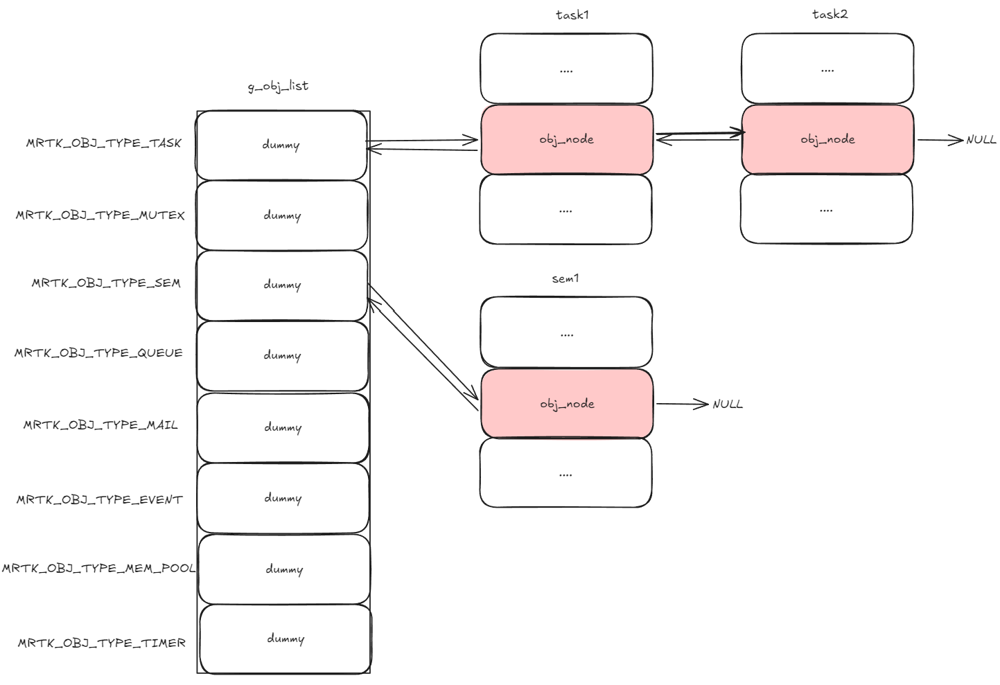
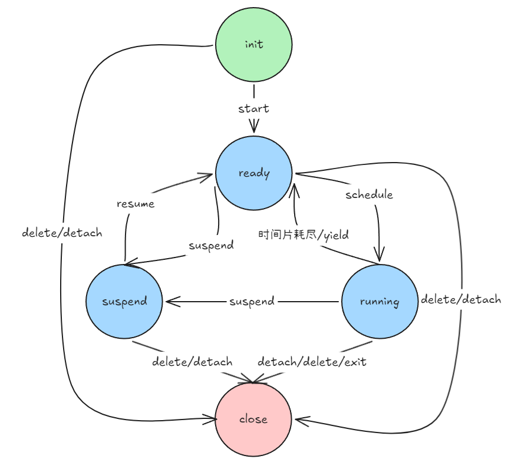
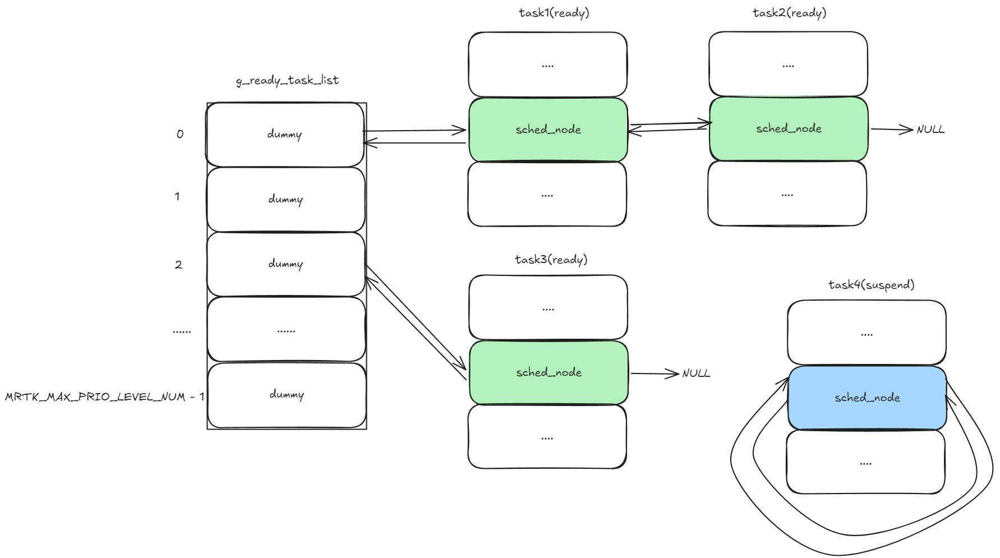
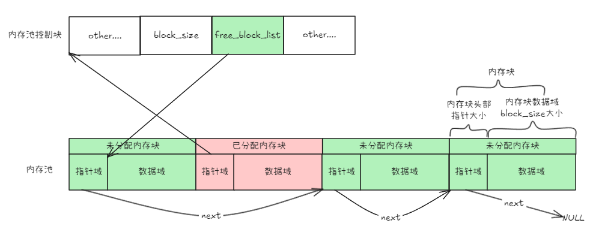
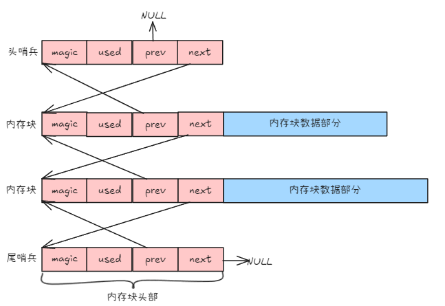
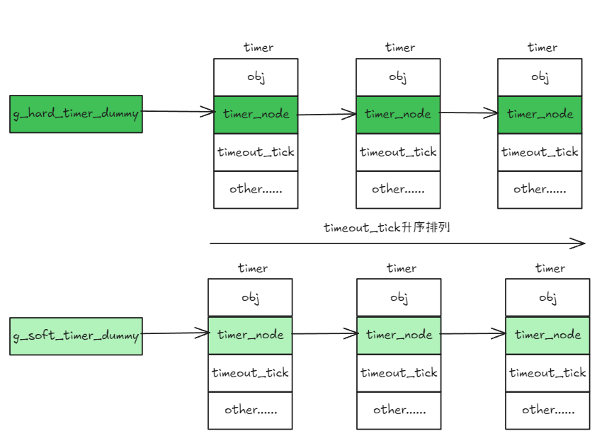

# MicroRT-Kernel

**一个轻量级的实时操作系统内核**

---

## 📖 项目简介

**MicroRT-Kernel (MRTK)** 是一个轻量级实时操作系统内核。项目采用现代 C11 标准编写，遵循面向对象设计原则，提供 RTOS 核心功能，包括优先级抢占式调度器、进程间通信 (IPC) 机制、多种内存管理策略和软件定时器。

- ✨ **模块化设计** - 通过配置文件灵活裁剪功能，最小化 RAM 占用
- ⚡ **高性能** - O(1) 调度算法，位图优先级查找表
- 🔒 **安全可靠** - 完整的单元测试覆盖，Google Test/Mock 框架验证
- 📚 **易于使用** - FreeRTOS 风格配置系统，规范Doxygen风格注释

## 🎯 核心特性

### 面向对象体系

内核对象体系：



所有内核对象均通过 ``obj_node`` 成员串接在``g_obj_list``数组中对应类型链表上统一管理。

所有对象的生命周期管理API分为两套：

- ``init``/``detach``适用于静态对象，比如``mrtk_task_init``
- ``create``/``delete``适用于动态对象，比如``mrtk_task_create``



### 中断管理

- **中断嵌套** - 支持多级中断嵌套
- **延迟调度** - 上下文切换延迟到最外层中断退出
- **临界区保护** - 完整的中断开关控制

### 任务与调度

任务状态机迁移：



就绪队列数据结构：使用**侵入式双向循环链表**将任务的调度节点``sched_node``挂入``g_ready_task_list``优先级链表中。



可抢占式调度算法：

- 相同优先级：时间片轮转
- 不同优先级：高优先级优先

调度器使用位图记录优先级队列是否有任务，通过查找表或指令实现最高优先级的O(1)查找。

### 内存管理

提供两套互补的内存管理策略：**内存池**、**内存堆**，分别提供定长内存块和不定长内存块的分配。

一个内存池或内存堆由多个**内存块**组成，每个内存块由**头部**和**数据部分**组成。

#### 内存池（静态内存）

针对固定长度内存的内存池管理：

- **隐式头部**：内存块采用 指针域+数据域 的物理结构，用户对指针域不感知，`mrtk_mp_alloc` 返回的指针和 `mrtk_mp_free` 传入的指针均指向内存块数据域首地址。
- **指针域复用**
  - 当内存块空闲时，指针域用于将空闲内存块串接到`free_block_list`指针上，组织为一条非侵入式单向链表。
  - 当内存块已分配，指针域指向内存池控制块首地址，`mrtk_mp_free` 通过回溯头部指针自动推导所属内存池，简化api调用实现无感释放，与传统free接口保持一致性。
- **创建方式**：
  - 动态创建：内存池控制块与内存缓冲区均从堆中自动申请，由内核全权管理。
  - 静态创建：支持用户传入自定义内存缓冲区实现内存托管，内存的所有权和生命周期由用户管控，而非内核
- **性能特征**：申请与释放动作时间复杂度为O(1)，均在常数时间内完成。

其结构如下图所示：



#### 内存堆（动态内存）

针对不定长度内存的堆内存管理：

- **分配策略**：采用 首次适应算法，在内存块链表中查找第一个满足大小的空闲内存块，兼顾分配速度与碎片控制。
- **内存合并**：释放内存时，自动检测并合并相邻的空闲内存块，有效减少外部碎片。
- **生命周期**：由内核统一管理，用户需确保 `mrtk_malloc` 与 `mrtk_free` 成对使用，防止内存泄漏。
- **性能特征**：
  - 申请动作时间复杂度为``O(N)``，时间取决于空闲块的位置，存在一定波动。
  - ``next``、``prev``通过基址偏移量而非指针，故释放动作时间复杂度为O(1)。

其结构如下图所示：



## 

### 定时器管理

定时器支持 单次触发/周期触发 ，所有的定时器挂接于两条全局定时器链表，均按 超时时间点 升序排列（超时时间点基于绝对时间累加，长期运行无累积误差，实现零漂移），并依据超时回调执行上下文分为两类：

- **硬定时器**链表，超时回调函数在**中断上下文**中执行
- **软定时器**链表，超时回调函数在**定时器守护任务上下文**中执行



定时模块不负责永久等待，任务调度（Scheduler/IPC）才负责永久等待，即一个永远不触发的定时器等于没有启动的定时器。

超时时间点基于绝对时间累加，长期运行无累积误差，实现零漂移。

### 进程间通信 (IPC)

| 机制         | 特性                      | 适用场景                |
| ------------ | ------------------------- | ----------------------- |
| **信号量**   | 资源计数、FIFO/优先级唤醒 | 资源同步、生产者-消费者 |
| **互斥量**   | 优先级继承、互斥访问      | 临界区保护              |
| **消息队列** | 变长消息、紧急消息支持    | 复杂数据传递            |
| **邮箱**     | 基于指针的消息传递        | 高效大数据传输          |
| **事件组**   | 事件标志同步              | 多事件等待              |


## 🧪 测试框架

### Mock 框架

项目使用 Google Mock 模拟硬件层，实现主机测试：

```cpp
class MockCpuPort {
  public:
    MOCK_METHOD((mrtk_base_t), mrtk_hw_interrupt_disable, (), ());
    MOCK_METHOD((void), mrtk_hw_interrupt_enable, (mrtk_base_t level), ());
    MOCK_METHOD((void), mrtk_hw_context_switch_interrupt, (), ());
};
```

**C/C++ 桥接机制：**

- C++ 全局 Mock 对象
- C 包装函数桥接到 Mock 方法
- 测试用例通过 `mrtk_mock_set_cpu_port()` 注入 Mock 对象

### 测试覆盖范围

| 模块           | 测试文件                | 测试用例数 | 覆盖内容                                                                                                                                                                                                          |
| :------------- | :---------------------- | :--------- | :---------------------------------------------------------------------------------------------------------------------------------------------------------------------------------------------------------------- |
| **事件标志组** | mrtk_test_event.cc      | 35         | 边界值分析（set=0/0xFFFFFFFF/0x80000000）、等价类划分（NULL参数、非法flag）、分支覆盖（AND/OR条件、自动清除、阻塞/非阻塞）、状态机覆盖、API全覆盖（init/detach/create/delete/send/recv/control）                  |
| **邮箱**       | mrtk_test_mail_box.cc   | 27         | 环形缓冲区回绕验证、满/空边界测试、双向唤醒机制、FIFO/PRIO策略测试、阻塞/非阻塞收发、API全覆盖（init/detach/create/delete/send_wait/recv/control）                                                                |
| **堆内存管理** | mrtk_test_mem_heap.cc   | 29         | 块合并算法（前向/后向/双向）、对齐边界测试、碎片化场景、链表完整性验证、NULL指针防御、边界值分析（0/最小/最大块）                                                                                                 |
| **内存池管理** | mrtk_test_mem_pool.cc   | 28         | 固定大小块分配、空闲链表管理、任务阻塞与唤醒、对齐处理、静态/动态对象、池耗尽边界、API全覆盖（init/detach/create/destroy/alloc/free）                                                                             |
| **消息队列**   | mrtk_test_msg_queue.cc  | 30         | 消息链表维护、大小检查、FIFO顺序验证、紧急消息插入、满/空边界、双向唤醒、API全覆盖（init/detach/create/delete/send_wait/recv/urgent）                                                                             |
| **互斥量**     | mrtk_test_mutex.cc      | 38         | 递归锁、优先级继承机制、嵌套计数边界（255溢出）、FIFO/PRIO唤醒策略、中断上下文限制、死锁预防、API全覆盖（init/detach/create/delete/take/trytake/release/control）                                                 |
| **信号量**     | mrtk_test_sem.cc        | 44         | 资源计数管理、二值信号量、计数信号量、资源耗尽与回卷边界、阻塞/非阻塞获取、释放操作、API全覆盖（init/detach/create/delete/take/trytake/release/control）                                                          |
| **软件定时器** | mrtk_test_timer.cc      | 43         | 32位回卷边界、周期定时器零漂移、双链表隔离（硬/软定时器）、时间控制引擎、边界值分析（timeout=0/MRTK_WAITING_FOREVER）、状态机覆盖、API全覆盖（init/start/stop/control/detach/delete）                             |
| **中断管理**   | mrtk_test_irq.cc        | 21         | 中断嵌套层数管理、PRIMASK保存恢复、延迟调度触发、调度器锁交互、上下文切换时机、临界区保护、嵌套层数溢出边界                                                                                                       |
| **双向链表**   | mrtk_test_list.cc       | 26         | 空链表、单节点、多节点、1000节点压力测试、遍历宏（MRTK_LIST_FOR_EACH、MRTK_LIST_FOR_EACH_SAFE）、容器宏（_mrtk_list_entry/MRTK_CONTAINER_OF）、链表完整性验证                                                     |
| **环形缓冲区** | mrtk_test_ringbuffer.cc | 38         | 缓冲区大小边界（0/1/2/小/大）、读写指针绕回、满/空状态转换、批量读写、单字节操作、数据一致性验证、交替读写压力测试、API全覆盖（init/read/write/putc/getc/get_len/get_free/is_empty/is_full）                      |
| **任务管理**   | mrtk_test_task.cc       | 56         | 优先级边界值、栈大小边界、时间片边界、任务状态机（INIT/READY/RUNNING/SUSPEND/CLOSE）、静态/动态对象、状态转换、中断上下文限制、内置定时器、API全覆盖（init/detach/create/delete/start/suspend/resume/yield/self） |
| **调度器**     | mrtk_test_schedule.cc   | 41         | 位图调度算法、优先级边界、就绪队列管理、调度锁嵌套、插入/移除任务、同优先级FIFO调度、位图一致性验证、空闲任务机制、最高优先级查找（CLZ指令优化）                                                                  |

## 🚀快速开始

### 环境要求

**主机测试模式（无需 ARM 工具链）：**

- **编译器：** Clang (Windows) / GCC (Linux/macOS)
- **构建工具：** CMake 3.30+
- **测试框架：** Google Test/Mock（自动下载）
- **操作系统：** Windows / Linux / macOS

**STM32 交叉编译模式：**

- **交叉编译器：** arm-none-eabi-gcc
- **目标平台：** STM32F407 (ARM Cortex-M4)

### 主机测试模式

```bash
# 1. 克隆项目
git clone https://github.com/leiyx/MicroRT-Kernel.git

# 2. 配置项目（TEST 模式）
cmake -B build -DCMAKE_BUILD_TYPE=TEST

# 3. 编译项目
cmake --build build

# 4. 运行测试
ctest --test-dir build --verbose

# 或者直接运行测试可执行文件
cd build/Test && ./mrtk_test_demo.exe

# 运行单个测试用例
./mrtk_test_demo.exe --gtest_filter="MemHeapTest.*"
```

### STM32 交叉编译

当前Port层只实现了STM32F407（Cortex-M4）相关：见example分支。
